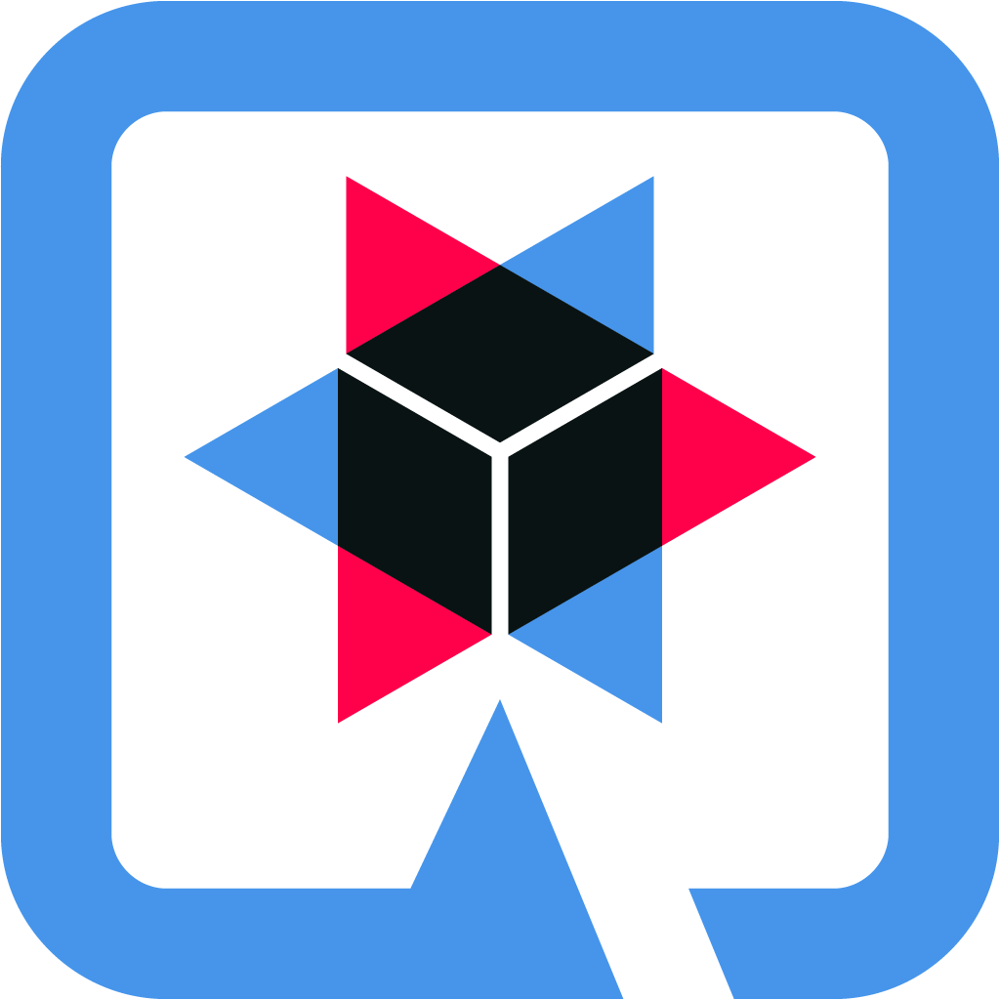
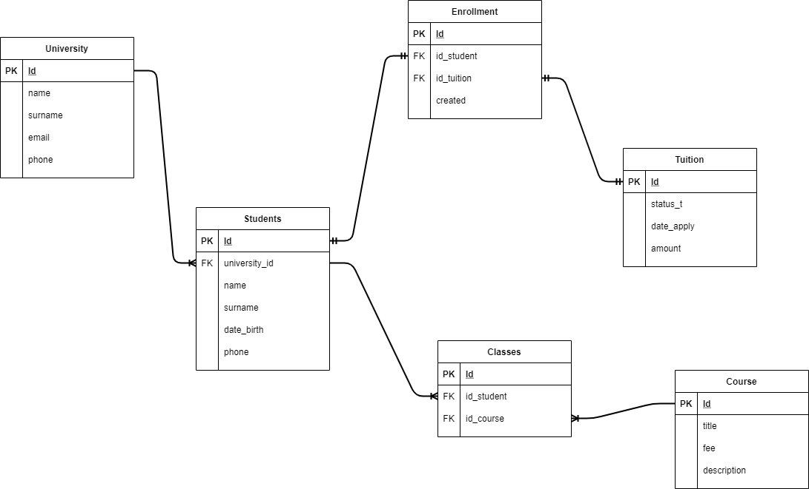

# College API REST Quarkus

## About this Project
Wellcome to my Project College API Rest with DAO Pattern and Quarkus FrameWork related to Java. This project is a API related to College System where you will find and get data of: Students, Universities, Tuition, Enrollments and Courses.
Things to consider:
---
1. This project has branches which are related with "Programming" asignature where are basically related with:
- This API's using MySQL, you can find it here:

- This API's using MariaDB, you can find it here:

- This API's using PostGreSQL, it's the default Database that I use, you can find it here:

- This API's using PostGreSQL with Active Record Pattern:

- This API's using name of the Student as ID and using mappedBy with this:

- This API's using ID type Long of the Student as ID and using mappedBy with this:

2. This Project use all type of Relations: @OneToOne, @OneToMany, @ManyToOne, @ManyToMany. With bidirectional and unidirectional form. All these relations are adaptared with the Entities and Tables.
- Relation @OneToOne using a Brigde Table "Enrollment":

- Relation @ManyToOne and @OneToMany bidirectional -> Student -> University:

- Relation @ManyToMany using a Bridge Table "Classes" using @ManyToOne unidirectional(It's a way to do it in replace of to do @ManyToMany with @JoinTable which it's inneficient because we cannot add more field in this Brigde Entity in a JPA context):

3. You can find the Definition of SQL tables here:


---

### Important: If you want more details about why there are a lot of branches and my process you can go to Reflections's section

<br>

[](URL_Proyecto)

<!--Logos-->

<br>



<br>


<br>


<br>


## Tabla de Contenidos

1. [Tecnologías Usadas](#tecnologias-usadas)
1. [Relational Entity Diagram](#relational-entity-diagram)
1. [Apuntes](#apuntes)
1. [Data API Rest JSON](#data-api-rest-json)
1. [Licencia](#licencia)

---

## Tecnologías Usadas

- Java JDK 11
- Maven
- Visual Studio Code
- IntelliJ
- Git
- Docker
- Quarkus
- Panache
- TestContainers


**[⬆ back to top](#tabla-de-contenidos)**


---

## RELATIONAL ENTITY DIAGRAM




**[⬆ back to top](#tabla-de-contenidos)**

---
## Data API Rest JSON

### Example with Students:
```json

// GET All http://localhost:8080/api/students/all

[
    {
        "name": "Mateo",
        "surname": "Alvarez",
        "dateBirth": "2005-06-05",
        "phone": "+34 666666666",
        "id": 1050
    },
    {
        "name": "Will",
        "surname": "Smith",
        "dateBirth": "1999-06-17",
        "phone": "+34 677878997",
        "id": 2050
    }
]


// POST : http://localhost:8080/api/students/add
{
    "name": "Pedro",
    "surname": "Gimenez",
    "dateBirth": "1990-12-17",
    "phone": "+34 687687878",
    "university": {
        "id": 1
    }
}
// GET by name : http://localhost:8080/api/students/Mateo

{
    "name": "Mateo",
    "surname": "Alvarez",
    "dateBirth": "2005-06-05",
    "phone": "+34 666666666",
    "id": 1050
}

// PUT : http://localhost:8080/api/students/put

{
    "name": "Pedro",
    "surname": "Gomez",
    "dateBirth": "2010-12-17",
    "phone": "+34 677777777",
    "university": {
        "id": 50
    }
}

// DELETE : http://localhost:8080/api/students/delete/1050
[
    {
        "name": "Will",
        "surname": "Smith",
        "dateBirth": "1999-06-17",
        "phone": "+34 677878997",
        "id": 2050
    }
]

```


**[⬆ back to top](#tabla-de-contenidos)**

---


---

## Reflexiones
### Que has mejorado con este proyecto?
This Project has let me to learn how to create an API REST using DAO Pattern and using all type of Relationals JPA and SQL: @OneToOne, @OneToMany, @ManyToOne, @ManyToMany

This project let me to understand better all concepts trying to create a Real Simulation of a API with I was trying to test different DataTypes of SQL with DataTypes of Java and test if it's works

I prefer DAO pattern because let me to separate more the Layers in the API and because The Entity doesn't have to managed by itself like in the Active Pattern where through PanacheEntity, the Entity use the methods like a EntityManager. So this pattern let me to separate the EntityManager from the Entity itself with a new layer called: RESPOSITORY


**[⬆ back to top](#tabla-de-contenidos)**


---


## Licencia

MIT License

Copyright (c) 2021 Mateo Garcia Gonzalez

Permission is hereby granted, free of charge, to any person obtaining a copy
of this software and associated documentation files (the "Software"), to deal
in the Software without restriction, including without limitation the rights
to use, copy, modify, merge, publish, distribute, sublicense, and/or sell
copies of the Software, and to permit persons to whom the Software is
furnished to do so, subject to the following conditions:

The above copyright notice and this permission notice shall be included in all
copies or substantial portions of the Software.


**[⬆ back to top](#tabla-de-contenidos)**

---


## Autor
Mateo Garcia Gonzalez


---
